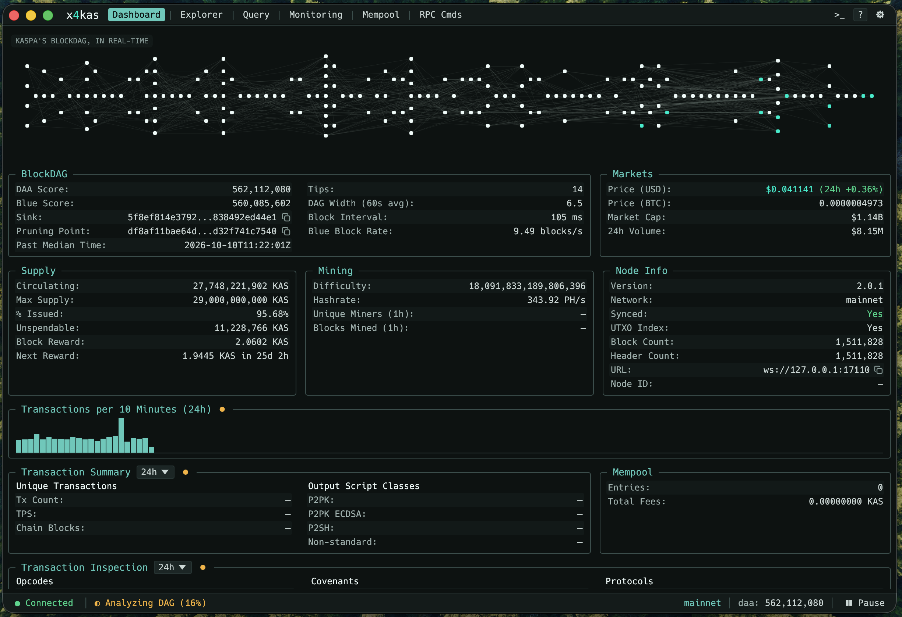

# x4kas - Kaspa Terminal

A Bloomberg Terminal inspired all-in-one Kaspa desktop app. 

> [!WARNING]
> **Beta:** x4kas is in beta. Expect bugs, inaccurate data, and changes. Please report issues.

x4kas currently includes features for monitoring & analyzing the Kaspa network. See [Features](#features) below for more information. Over time, this will grow into an amalgamation of (probably far) too much in one mono-app. See the [Roadmap](#roadmap) below for more information.

Two binaries are provided to support different modes of interaction:
- GUI
- CLI (an attempt at giving local agents something to work with)



## Features

- **Dashboard**: live BlockDAG visualizer, supply, mining, markets, fees, mempool and transaction analytics
- **Explorer**: tabbed block, transaction, address and protocol pages, plus an info pane that opens from any link
- **Address index**: local index of the chain with balances, history, counterparties, ownership clustering and peel chains
- **Queries**: query builder and text language over transactions, blocks, payouts and addresses, with saved queries and alerts
- **Watchlist**: real-time address monitoring with alert rules
- **RPC console**: 36 read-only node RPC methods with a JSON viewer
- **Export**: CSV/JSON for transactions, flows, blocks and query results
- **CLI**: `x4kas-cli` for headless RPC, indexing, queries, address lookups and watching

## Getting Started

### Install

**Prebuilt binaries**: download the archive for your platform from [Releases](https://github.com/smartgoo/x4kas/releases) (`x4kas-<version>-<target>.tar.gz`, `.zip` on Windows). Releases contains both `x4kas` (GUI) and `x4kas-cli`.

- macOS: the GUI is `x4kas.app` (from 0.1.1; 0.1.0 has a bare `x4kas` binary, which Finder opens in a Terminal window); drag it to Applications. It isn't signed yet, so macOS blocks it on first launch ("Apple could not verify…"). Clear the download's quarantine flag in the unpacked folder:
  ```bash
  xattr -dr com.apple.quarantine .
  ```
  Or try to open it once, then allow it in System Settings → Privacy & Security → Open Anyway.
- Linux: needs X11 or Wayland, `libxkbcommon` and OpenSSL 3 (glibc 2.35+, e.g. Ubuntu 22.04 or newer).

**From source** (Rust 1.91+):

On Debian/Ubuntu, first install the GUI's build dependencies: `sudo apt install pkg-config libssl-dev libxkbcommon-dev libxcb-render0-dev libxcb-shape0-dev libxcb-xfixes0-dev`

Install via `cargo install` or clone the repo and build locally.

Cargo install:
```bash
cargo install --locked --git https://github.com/smartgoo/x4kas x4kas-gui x4kas-cli
```

For CLI usage, see [CLI usage](#cli-usage) below.

## Indexing

x4kas builds its own index of the chain locally. Most other app features (analytics, the Explorer's address pages, flows and queries) read from this index.

- **Source**: polls VSPCv2 via `get_virtual_chain_from_block_v2` with full verbosity.
- **Start**: resumes where it left off. A fresh index backfills the last 24h (`--backfill-hours` in the CLI).
- **Store**: an embedded [fjall](https://github.com/fjall-rs/fjall) database located at `~/.x4kas/index/<network>/`, split into 6-hour slabs and pruned.
- **Contents**: transactions, blocks, miners, per-address history and stats, counterparties, ownership clusters and dashboard analytics. Full payloads and P2SH redeem scripts are opt-in (Settings › Index, or `x4kas-cli index settings`).
- **Reorgs**: changes to the selected chain are undone and reapplied, committed atomically.
- **Owned by**: the GUI while connected to a node, or `x4kas-cli index run` headless. **Only one of these processes at a time holds exclusive access to the index (this will be fixed in the future)**

### Pruning

The index prunes similar to a Kaspa node.

- After every batch, any 6-hour slab that ends before the node's pruning point is deleted as a whole. This removes its transactions, blocks, per-address history and stats, counterparties, and opt-in payloads and redeem scripts. Because whole slabs are dropped, up to six extra hours past the pruning point can stay on disk until the next slab boundary passes.
- Address totals, balance history and query results cover the retained slabs only, not the address's full lifetime. The Analyzer hover and `x4kas-cli index status` show how far back the index reaches.
- Dashboard analytics keep their own 24-hour window and are pruned separately.
- Not pruned yet: the address-to-id table and the ownership clusters. They grow for as long as the index runs.
- If the index falls behind the node's pruning point, for example after being offline for a long time, it restarts from the pruning point. The time in between is never indexed.

## CLI Usage

`x4kas-cli` runs headless (no display needed). Global options: `--url ws://host:17110` (default: public resolver), `--network mainnet|testnet-10|testnet-11`.

```bash
# Node RPC (36 read-only methods)
x4kas-cli rpc get_block_dag_info

# Build/update the local index from your node (until Ctrl+C)
x4kas-cli --url ws://127.0.0.1:17110 index run --backfill-hours 24
x4kas-cli index status

# Addresses (reads the index, no node needed)
x4kas-cli address profile kaspa:qq...
x4kas-cli address txs kaspa:qq... --all --format csv
x4kas-cli address flows kaspa:qq... --hops 2 --collapse

# Queries
x4kas-cli query run "tx last 1d where fee > 1 KAS order by fee desc limit 20"
x4kas-cli query fields tx
x4kas-cli query save big-fees "tx last 1h where fee > 1 KAS" --watch

# Live address watching (JSON lines)
x4kas-cli watch kaspa:qq...

# Labels
x4kas-cli labels set kaspa:qq... "My wallet"
```

Index-reading commands (`address`, `query run`) need the index to be free: they can't run while the GUI (connected to a node) or `index run` holds it. Run `x4kas-cli <command> --help` for details.

## Roadmap
- Split indexer off to its own daemon. With built in API to serve CLI and GUI requests
- Historical charts for data
- Embedded Kaspa node
- Analysis against local node's RocksDB instance
- Add Wallet functionality
- Full support for KCCs
- SilverScript/Argent (no idea what this looks like yet but needs to be on roadmap :) )
- Ecosystem integrations (Name services, messaging, etc)
- "Desktop" / "Workspace" view